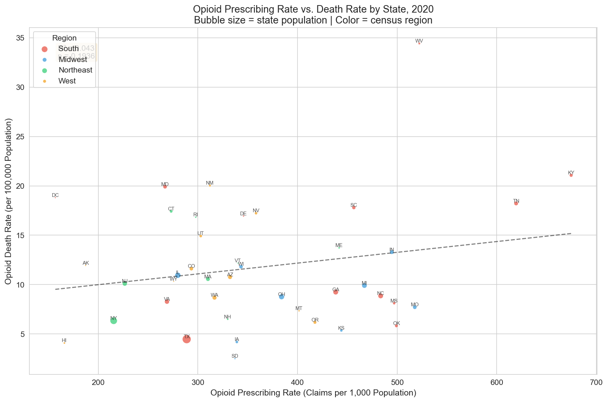
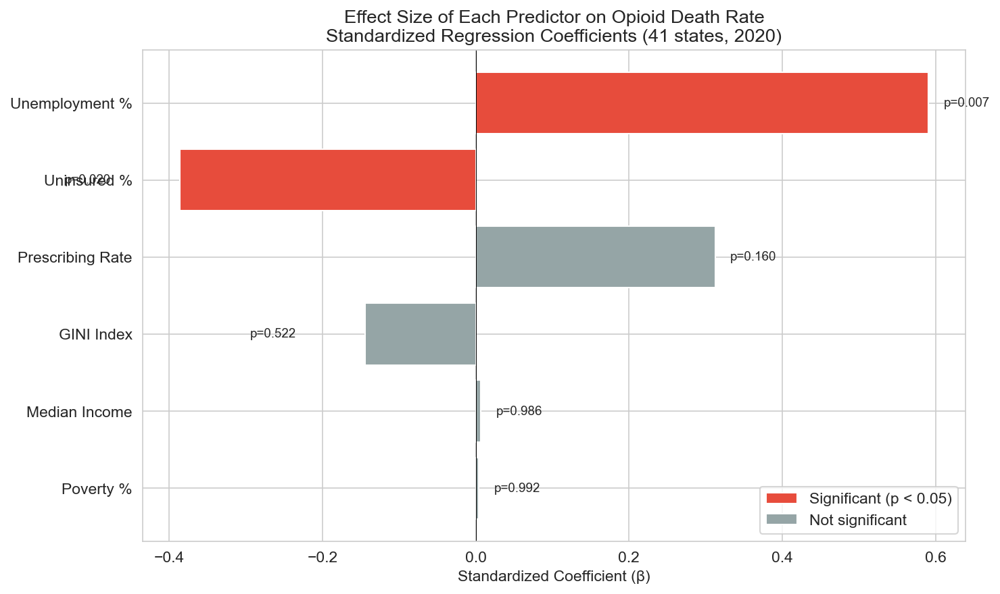
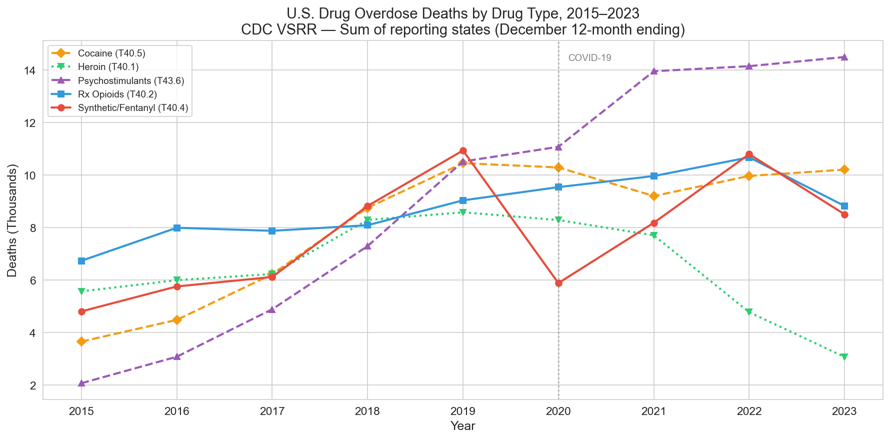
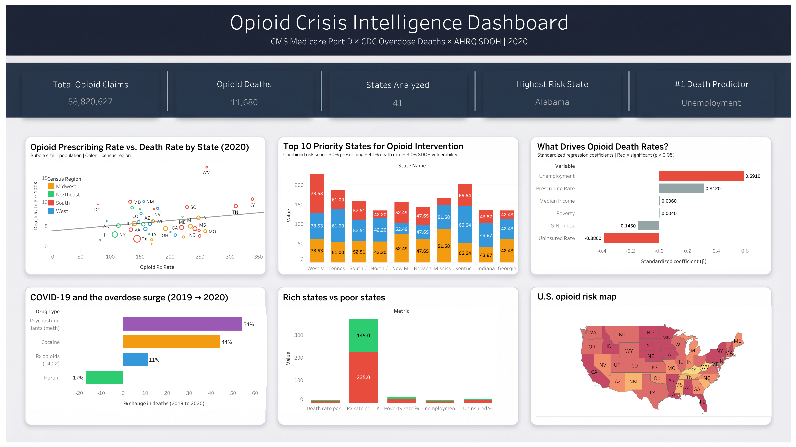
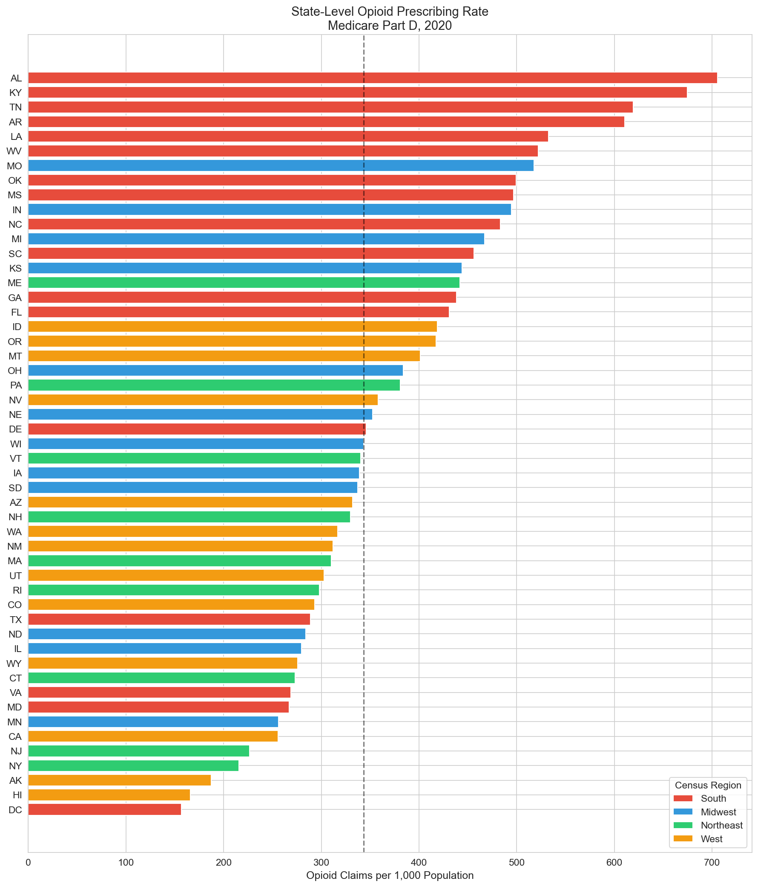
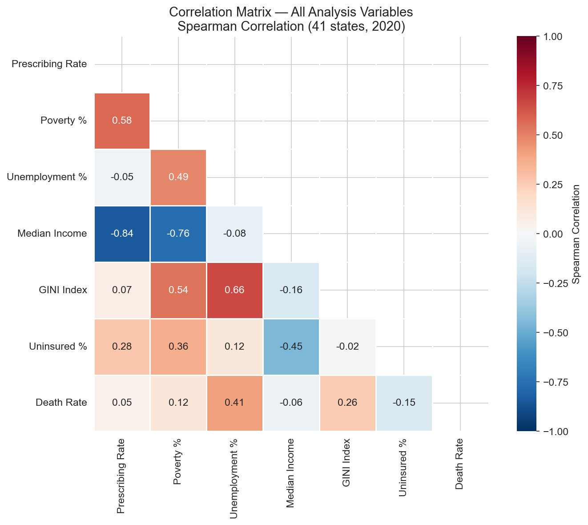

# Opioid Pipeline Analysis

**A multi-source analytics pipeline investigating the relationship between physician opioid prescribing patterns, overdose mortality, and socioeconomic vulnerability across U.S. states.**

[](https://public.tableau.com/app/profile/krunal.vaghasiya/viz/OpioidCrisisIntelligenceDashboard/Dashboard)

---

## Business Question

> *Which U.S. regions show the strongest link between physician opioid prescribing patterns and overdose mortality, and what socioeconomic factors amplify or buffer this relationship — so a state health department can prioritize intervention resources?*

**Simulated stakeholder**: A state health department's opioid prevention program that uses data to plan naloxone distribution, target prescriber education campaigns, and allocate intervention resources.

---

## Key Findings

### 1. Prescribing rate alone does NOT predict overdose deaths

The bivariate correlation between state-level opioid prescribing rates and overdose death rates is weak and not statistically significant (R² = 0.043, p = 0.19). States that prescribe more opioids do not necessarily have higher death rates.



### 2. Unemployment is the strongest predictor of overdose death rates

Adding socioeconomic controls improved the model from R² = 0.043 to R² = 0.369 — a 9x improvement. Unemployment emerged as the dominant predictor (β = 0.59, p = 0.007), consistent with Case & Deaton's "deaths of despair" framework.



### 3. Top 10 priority states identified for intervention

A combined risk score (30% prescribing + 40% death rate + 30% SDOH vulnerability) identifies the states where intervention is most needed:

| Rank | State | Combined Score | Key Driver |
|------|-------|---------------|------------|
| 1 | West Virginia | 78.5 | Highest death rate (17.21/100K) |
| 2 | Kentucky | 66.6 | Very high prescribing (337/1K) |
| 3 | Tennessee | 61.0 | High prescribing + SDOH risk |
| 4 | South Carolina | 52.5 | High death rate + SDOH risk |
| 5 | New Mexico | 52.5 | Highest SDOH vulnerability (73.5) |
| 6 | Mississippi | 51.6 | Highest SDOH risk nationally (86.5) |
| 7 | Nevada | 47.7 | High death rate + moderate SDOH |
| 8 | Indiana | 43.9 | Known opioid crisis state |
| 9 | Georgia | 42.4 | High SDOH risk (62.0) |
| 10 | North Carolina | 42.2 | High prescribing + SDOH risk |

7 of 10 priority states are in the South. 4 of 5 known opioid crisis hotspots (WV, KY, TN, IN) appear in the top 10.

### 4. COVID-19 accelerated meth and cocaine deaths — not Rx opioids

Between 2019 and 2020, psychostimulant (meth) deaths surged +54% and cocaine deaths +44%, while prescription opioid deaths rose only +11%. Heroin deaths actually declined -17% as users shifted to illicit fentanyl.



### 5. Lower-income states have nearly 2x the death rate

States with below-median household income average 7.8 deaths per 100K compared to 4.1 for above-median states — reinforcing the economic vulnerability finding from the regression.

---

## Interactive Dashboard

**[View the live Tableau dashboard →](https://public.tableau.com/app/profile/krunal.vaghasiya/viz/OpioidCrisisIntelligenceDashboard/Dashboard)**



The dashboard includes 6 analytical views: prescribing vs death scatter plot, top 10 priority states, regression driver analysis, COVID-19 overdose surge, rich vs poor state comparison, and a U.S. choropleth risk map.

---

## Methodology

This project follows the **CRISP-DM** (Cross-Industry Standard Process for Data Mining) methodology across 6 phases.

### Data Sources

| Dataset | Source | Granularity | Size |
|---------|--------|-------------|------|
| Medicare Part D Prescribers | CMS | Provider × Drug | 25M+ rows |
| Provisional Drug Overdose Deaths | CDC VSRR | State × Month × Indicator | 163K rows |
| Social Determinants of Health | AHRQ | County-level | 6,400 rows |

**Analysis year**: 2020 — the most recent year with full overlap across all three datasets (AHRQ ends at 2020). Single-year cross-sectional design.



### Pipeline Architecture

```
CMS Part D (25M rows)          CDC VSRR (163K rows)       AHRQ SDOH (6.4K rows)
       │                              │                           │
       ▼                              ▼                           ▼
  Filter opioids              Dedup + filter to            Dedup + exclude
  Remove 5 false              T40.2/T40.3 indicator        territories
  positives                   Dec 2020 only                Pop-weighted avg
  Exclude territories                                      county → state
       │                              │                           │
       ▼                              ▼                           ▼
  clean_cms_state             clean_cdc_state              agg_state_sdoh
  (51 rows)                   (41 rows)                    (51 rows)
       │                              │                           │
       └──────────────┬───────────────┘───────────────────────────┘
                      ▼
              dim_state (bridge table)
                      │
                      ▼
           fact_opioid_analysis
           (51 rows × 31 columns)
                      │
                      ▼
        Feature Engineering: rates,
        quartiles, SDOH risk score,
        combined risk ranking
```

### Statistical Methods

- **Spearman correlation** (non-parametric, handles skewed distributions)
- **Multiple linear regression** with OLS (prescribing rate + 5 SDOH controls)
- **Kruskal-Wallis test** for quartile comparison
- **Gradient boosting** for feature importance cross-validation
- **Cook's distance** for influential outlier detection
- **VIF** for multicollinearity assessment



### Key Technical Decisions

| Decision | Rationale |
|----------|-----------|
| Drug name regex instead of Opioid_Drug_Flag | CMS file lacked the expected flag column |
| T40.2/T40.3 indicator instead of broad T40.0-T40.6 | Broad indicator only available for 20/51 states |
| Population-weighted SDOH averages | Simple means would over-represent tiny counties |
| LEFT JOIN for CDC data | Preserves 51 states even though 10 lack death data |
| Spearman over Pearson correlation | SDOH distributions are right-skewed |

---

## Results Summary

| Criterion | Target | Result |
|-----------|--------|--------|
| Significant correlation (p < 0.05) | ✅ | Unemployment: r = 0.41, p = 0.008 |
| Multiple regression R² ≥ 0.50 | ⚠️ | R² = 0.369 (Adj = 0.258), F p = 0.011 |
| Top 10 priority states | ✅ | WV, KY, TN, SC, NM, MS, NV, IN, GA, NC |
| 3–5 actionable recommendations | ✅ | 5 recommendations delivered |
| Interactive Tableau dashboard | ✅ | Published on Tableau Public |
| All 3 data sources merged | ✅ | Joined via dim_state bridge table |

The R² gap (0.369 vs 0.50 target) is an honest finding — the disconnect between prescribed opioid rates and death rates reflects the crisis shifting from prescription pills to illicit fentanyl post-2016.

---

## Limitations

1. **Ecological fallacy** — state-level correlations do not prove individual-level causation
2. **Population coverage** — CMS Part D covers Medicare (65+) only, missing younger high-risk populations
3. **Illicit fentanyl confound** — post-2016 overdose deaths increasingly driven by illicit sources, not prescriptions
4. **Missing states** — 10 states (including CA, FL, PA) lack death data under our CDC indicator
5. **Single-year analysis** — 2020 results may reflect COVID-19-specific conditions
6. **Small sample** — 41 states with 6 predictors limits statistical power

---

## Repository Structure

```
opioid-pipeline-analysis/
├── README.md
├── 01_business_understanding.md
├── data/
│   └── processed/              ← Analysis CSVs (raw data gitignored)
├── notebooks/
│   ├── 01_data_ingestion_cleaning.ipynb
│   ├── 02_exploratory_analysis.ipynb
│   ├── 03_data_preparation.ipynb
│   ├── 04_modeling.ipynb
│   ├── 05_evaluation.ipynb
│   └── 06_dashboard_exports.ipynb
├── sql/
│   ├── 03_data_cleaning.sql
│   ├── 04_master_merge.sql     ← 4-CTE join query (technical showcase)
│   └── 05_feature_engineering.sql
├── figures/                    ← All EDA and modeling visualizations
├── dashboards/
│   ├── screenshots/
│   └── tableau_public_link.md
└── requirements.txt
```

---

## Tech Stack

- **Python 3.11**: pandas, numpy, scipy, statsmodels, scikit-learn, seaborn, matplotlib
- **PostgreSQL**: Schema design, CTEs, window functions (NTILE), population-weighted aggregation
- **Tableau Public**: Interactive 6-view dashboard with KPI cards
- **Git/GitHub**: Version control and portfolio hosting

---

## How to Reproduce

1. Download the three datasets from CMS, CDC, and AHRQ (links in `01_business_understanding.md`)
2. Install PostgreSQL and create database `opioid_analysis`
3. Run SQL scripts in `sql/` folder in numbered order
4. Run notebooks in `notebooks/` folder in numbered order
5. Open `data/processed/fact_opioid_analysis.csv` in Tableau Public

```bash
pip install pandas numpy scipy statsmodels scikit-learn seaborn matplotlib sqlalchemy psycopg2-binary openpyxl
```

---

## Author

**Krunal** — MS in Data Analytics, Northeastern University (Dec 2026)

Targeting Data Analyst roles in Healthcare/Health Tech and Finance/Fintech.

[LinkedIn]([https://linkedin.com/in/www.linkedin.com/in/krunal-vaghasiya-85187932b/]) · [GitHub](https://github.com/Krunal2003)
